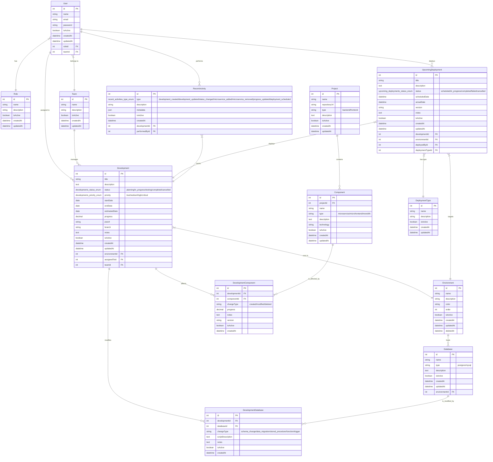

## Descripción General

Este sistema de seguimiento de desarrollos está diseñado para gestionar proyectos de software que incluyen múltiples repositorios, componentes (microservicios, microfronts, monolitos) y bases de datos distribuidas en diferentes ambientes.

## Principios de Diseño

- **Flexibilidad**: Soporte para monolitos, microservicios y microfrontends
- **Trazabilidad**: Seguimiento completo de cambios en código y bases de datos
- **Escalabilidad**: Arquitectura preparada para crecimiento
- **Consistencia**: Nomenclatura camelCase para compatibilidad con JavaScript/TypeScript
- **Integridad de datos**: Soft deletes para mantener referencias históricas
- **Auditoría completa**: Timestamps y eliminación lógica en entidades críticas

## Diagrama de Entidad-Relación



## Descripción de Entidades

### 👥 **Gestión de Usuarios y Equipos**

#### `User`
Usuarios del sistema con roles y equipos asignados.

#### `Role` 
Roles de usuario (admin, developer, manager, etc.).

#### `Team`
Equipos de trabajo que gestionan desarrollos.

### 🚀 **Core del Sistema de Desarrollos**

#### `Development`
Representa un desarrollo específico que puede afectar múltiples componentes y bases de datos.

**Campos clave:**
- `status`: Estado actual del desarrollo
- `priority`: Prioridad asignada
- `jiraUrl`: Enlace a ticket de Jira
- `branch`: Rama de desarrollo
- `environmentId`: Ambiente objetivo del desarrollo

#### `Environment`
Ambientes de despliegue (desarrollo, staging, producción).

**Campos clave:**
- `color`: Para identificación visual
- `order`: Orden de despliegue

### 🏗️ **Arquitectura de Proyectos**

#### `Project`
Repositorios de código (monorrepos o proyectos individuales).

**Tipos:**
- `backend`: Proyectos de servidor
- `frontend`: Proyectos de cliente

#### `Component`
Componentes dentro de proyectos (microservicios, microfronts, monolitos).

**Tipos:**
- `microservice`: Microservicio individual
- `microfrontend`: Microfrontend individual  
- `monolith`: Aplicación monolítica

**Campo `technology`:** Tecnología utilizada (Node.js, React, Angular, etc.)

### 🗄️ **Gestión de Bases de Datos**

#### `Database`
Bases de datos disponibles en el sistema.

**Tipos soportados:**
- `postgres`: PostgreSQL
- `mysql`: MySQL

**Relación con ambientes:** Cada BD pertenece a un ambiente específico.

### 🔗 **Relaciones de Desarrollo**

#### `DevelopmentComponent`
Relación many-to-many entre desarrollos y componentes.

**Campos clave:**
- `changeType`: Tipo de cambio (created/modified/deleted)
- `progress`: Progreso específico del componente
- `version`: Versión del componente

#### `DevelopmentDatabase`
Relación many-to-many entre desarrollos y bases de datos.

**Campos clave:**
- `changeType`: Tipo de cambio en BD
- `scriptDescription`: Descripción del script ejecutado

### 📦 **Gestión de Despliegues**

#### `UpcomingDeployment`
Despliegues programados o ejecutados.

#### `DeploymentType`
Tipos de despliegue (hotfix, feature, release).

#### `RecentActivity`
Auditoría de actividades del sistema.

## Enums Definidos

```sql
-- Estados de desarrollo
CREATE TYPE developments_status_enum AS ENUM (
    'planning', 'in_progress', 'testing', 'completed', 'cancelled'
);

-- Prioridades de desarrollo
CREATE TYPE developments_priority_enum AS ENUM (
    'low', 'medium', 'high', 'critical'
);

-- Estados de despliegue
CREATE TYPE upcoming_deployments_status_enum AS ENUM (
    'scheduled', 'in_progress', 'completed', 'failed', 'cancelled'
);

-- Tipos de actividad
CREATE TYPE recent_activities_type_enum AS ENUM (
    'development_created', 'development_updated', 'status_changed',
    'microservice_added', 'microservice_removed', 'progress_updated',
    'deployment_scheduled'
);
```

## Flujo de Datos Principal

1. **Creación de Proyecto**: Se crea un `Project` con sus `Components`
2. **Planificación**: Se crea un `Development` asignado a un `Environment`
3. **Asignación**: Se relacionan `Components` y `Databases` afectados
4. **Desarrollo**: Se actualiza progreso en `DevelopmentComponent`
5. **Scripts de BD**: Se documentan cambios en `DevelopmentDatabase`
6. **Despliegue**: Se programa en `UpcomingDeployment`
7. **Auditoría**: Se registra en `RecentActivity`

## Casos de Uso Principales

### Monolito Simple
- 1 `Project` → 1 `Component` (type: monolith)
- Desarrollo afecta ese único componente

### Microservicios (Monorrepo)
- 1 `Project` → múltiples `Components` (type: microservice)
- Desarrollo puede afectar varios microservicios del mismo repo

### Microfrontends
- 1 `Project` → múltiples `Components` (type: microfrontend)
- Cada microfrontend es un componente independiente

### Desarrollo Full-Stack
- Múltiples `Projects` (backend + frontend)
- Múltiples `Components` afectados
- Múltiples `Databases` con scripts

## Ventajas de la Arquitectura

- ✅ **Flexibilidad**: Soporta cualquier arquitectura de software
- ✅ **Trazabilidad**: Seguimiento completo de cambios
- ✅ **Escalabilidad**: Fácil agregar nuevos tipos y relaciones
- ✅ **Consistencia**: Nomenclatura uniforme
- ✅ **Auditoría**: Registro completo de actividades
- ✅ **Gestión multi-ambiente**: Separación clara por ambientes

## Estrategia de Soft Delete

### Entidades con Soft Delete
Las siguientes entidades implementan soft delete para preservar la integridad referencial:

- ✅ **Role**: Roles pueden ser eliminados pero mantener historial
- ✅ **Team**: Equipos pueden desactivarse sin perder desarrollos históricos  
- ✅ **Development**: Desarrollos cancelados/archivados mantienen trazabilidad
- ✅ **Environment**: Ambientes deprecados mantienen historial de despliegues
- ✅ **Project**: Proyectos archivados mantienen componentes y desarrollos
- ✅ **Component**: Componentes deprecados mantienen historial de cambios
- ✅ **Database**: Bases de datos legacy mantienen scripts ejecutados
- ✅ **DeploymentType**: Tipos de despliegue obsoletos mantienen historial

### Entidades sin Soft Delete
Estas entidades mantienen hard delete por su naturaleza:

- ❌ **User**: Los usuarios se desactivan con `isActive` pero no se eliminan
- ❌ **DevelopmentComponent**: Tablas de relación se eliminan físicamente
- ❌ **DevelopmentDatabase**: Tablas de relación se eliminan físicamente  
- ❌ **UpcomingDeployment**: Despliegues completados se mantienen para auditoría
- ❌ **RecentActivity**: Log de actividades se mantiene para auditoría

### Implementación
```sql
-- Ejemplo de query con soft delete
SELECT * FROM developments 
WHERE deletedAt IS NULL AND isActive = true;

-- Ejemplo de eliminación lógica
UPDATE developments 
SET deletedAt = NOW(), isActive = false 
WHERE id = 1;
```

## Consideraciones de Rendimiento

- **Índices recomendados**: FKs principales, campos de filtrado frecuente
- **Soft deletes**: Siempre incluir `WHERE deletedAt IS NULL` en queries principales
- **Índices compuestos**: `(isActive, deletedAt)` para entidades con soft delete
- **Paginación**: Implementar en listados principales
- **Cacheo**: Consultas frecuentes y conteos
- **Archivado**: Considerar mover registros antiguos a tablas de archivo

### Índices Recomendados

```sql
-- Índices para soft delete
CREATE INDEX idx_developments_active ON developments(isActive, deletedAt);
CREATE INDEX idx_projects_active ON projects(isActive, deletedAt);
CREATE INDEX idx_components_active ON components(isActive, deletedAt);

-- Índices para relaciones frecuentes
CREATE INDEX idx_development_components_dev ON development_components(developmentId);
CREATE INDEX idx_development_databases_dev ON development_databases(developmentId);
CREATE INDEX idx_components_project ON components(projectId);
```# Arquitectura de Base de Datos - Sistema de Seguimiento de Desarrollos
