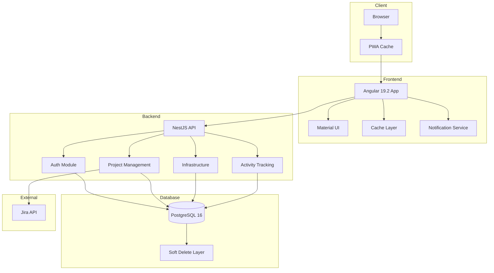
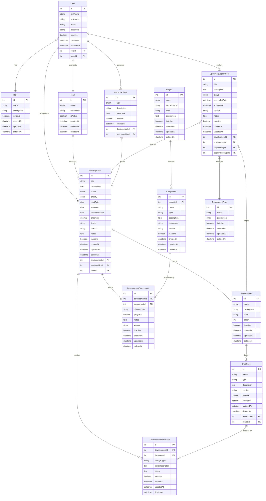

## Índice

0. [Ficha del proyecto](#0-ficha-del-proyecto)
1. [Descripción general del producto](#1-descripción-general-del-producto)
2. [Arquitectura del sistema](#2-arquitectura-del-sistema)
3. [Modelo de datos](#3-modelo-de-datos)
4. [Especificación de la API](#4-especificación-de-la-api)
5. [Historias de usuario](#5-historias-de-usuario)
6. [Tickets de trabajo](#6-tickets-de-trabajo)
7. [Pull requests](#7-pull-requests)

---

## 0. Ficha del proyecto

### **0.1. Tu nombre completo:**
Janier Chará Cardona

### **0.2. Nombre del proyecto:**
DevTracker - Sistema de Seguimiento de Desarrollos en Microservicios

### **0.3. Descripción breve del proyecto:**
DevTracker es una aplicación web full-stack diseñada para resolver el problema común de los desarrolladores junior en entornos de microservicios: el seguimiento manual de desarrollos a través de hojas de cálculo. La aplicación centraliza toda la información relacionada con los desarrollos, desde su concepción hasta su despliegue en producción, eliminando la dependencia de hojas de cálculo manuales y reduciendo significativamente los errores en los despliegues.

### **0.4. URL del proyecto:**

#### Frontend
- https://frontend-jcc-production.up.railway.app

#### Backend
- https://backend-jcc-production.up.railway.app

### **0.5. URL o archivo comprimido del repositorio**
https://github.com/jchara/AI4Devs-final.git

---

## 1. Descripción general del producto

DevTracker nace de una necesidad real de los desarrolladores junior que trabajan en entornos de microservicios. Actualmente, estos desarrolladores utilizan hojas de cálculo de Excel para llevar un registro manual del estado de cada proyecto, los microservicios modificados, scripts de base de datos y configuraciones de archivos YAML. Este proceso manual es propenso a errores y consume tiempo valioso que podría dedicarse al desarrollo.

### **1.1. Objetivo:**

El objetivo principal de DevTracker es proporcionar una solución integral que:

1. **Eliminar la Dependencia de Excel**
   - Reemplazar las hojas de cálculo manuales
   - Centralizar toda la información en una plataforma
   - Reducir errores en el seguimiento
   - Ahorrar tiempo en tareas administrativas

2. **Automatizar el Seguimiento**
   - Integración con Jira para sincronización de tareas
   - Registro automático de estados de desarrollo
   - Seguimiento de microservicios impactados
   - Control de scripts de base de datos

3. **Mejorar la Eficiencia**
   - Reducir el tiempo dedicado a tareas administrativas
   - Minimizar errores en despliegues
   - Optimizar el proceso de seguimiento
   - Facilitar la gestión de componentes

4. **Facilitar la Toma de Decisiones**
   - Proporcionar dashboards intuitivos
   - Ofrecer métricas claras del estado de los desarrollos
   - Permitir una visión global del progreso
   - Identificar rápidamente desarrollos pendientes

5. **Garantizar la Calidad**
   - Asegurar que ningún componente se olvide en los despliegues
   - Mantener un registro histórico de cambios
   - Facilitar la auditoría de desarrollos
   - Validar la completitud de los despliegues

**Público Objetivo:**
- Desarrolladores junior en microservicios
- Líderes técnicos
- Equipos de operaciones
- QA Engineers

**Valor Aportado:**
- Reducción del 50% en errores de despliegue
- Ahorro de 2 horas semanales por desarrollador
- Mejora en la visibilidad del estado de los desarrollos
- Centralización de la información de despliegues
- Automatización de tareas repetitivas

**Problemas que Resuelve:**
1. Dispersión de información en hojas de cálculo
2. Errores en despliegues por olvido de componentes
3. Tiempo excesivo en tareas administrativas
4. Falta de visibilidad del estado real de los desarrollos
5. Dificultad para rastrear cambios en múltiples ambientes

**Beneficios Clave:**
1. Mayor eficiencia en el proceso de desarrollo
2. Reducción de errores en despliegues
3. Mejor comunicación entre equipos
4. Toma de decisiones basada en datos
5. Mejora en la calidad del software entregado

### **1.2. Características y funcionalidades principales:**

1. **Gestión de Desarrollos**: Registro y seguimiento de desarrollos con estados básicos (Desarrollo, QA, Aprobado en QA, Producción, Rechazado), asociación con issues de Jira, y registro de microservicios impactados.

2. **Integración con Jira**: Conexión básica mediante API Key, sincronización manual de issues y visualización de información esencial de HUS/Épicas.

3. **Dashboard Principal**: Vista general de desarrollos activos con filtros básicos, búsqueda por nombre/ID, y resumen de estados con contadores y gráficos simples.

4. **Gestión de Componentes**: 
   - Registro de cambios en microservicios
   - Control de scripts de base de datos (SQL, procedimientos almacenados)
   - Gestión de archivos de configuración YAML con versionado
   - Seguimiento de dependencias entre componentes
   
5. **Interfaz de Usuario**: Diseño responsivo con navegación intuitiva, formularios simplificados y mensajes de confirmación.

6. **Seguridad Básica**: Sistema de autenticación con login/logout, protección de rutas y sesiones de usuario.

7. **Exportación de Datos**: Generación de reportes básicos en Excel con filtros simples y formato predefinido.

#### **Funcionalidades Avanzadas Implementadas**

8. **Sistema de Cache Inteligente**: 
   - Cache automático con timeout de 5 minutos en formularios
   - Validación de vigencia y fallback automático al servidor
   - Mejora significativa en tiempo de apertura de paneles (200-300ms)

9. **Notificaciones Centralizadas**: 
   - NotificationService unificado con colores específicos por tipo
   - Consistencia visual en toda la aplicación
   - Soporte para success, error, warning e info

10. **Optimizaciones de Rendimiento**:
    - Consolidación de imports de Angular Material (reducción 15-20% bundle size)
    - Debounce de 300ms en filtros de búsqueda
    - OnPush Change Detection Strategy en todos los componentes
    - Lazy loading y tree-shaking optimizado

11. **Sistema de Actividad Reciente**:
    - Tracking automático de todas las acciones del usuario
    - Historial completo de cambios por desarrollo
    - Métricas en tiempo real para dashboard

12. **Soft Delete Universal**:
    - Eliminación lógica implementada en todas las entidades
    - Capacidad de restauración de registros
    - Auditoría completa de cambios

13. **PWA Optimizada**:
    - Service Worker con estrategias de cache específicas
    - Soporte offline para funcionalidades básicas
    - Instalable como aplicación nativa

#### Limitaciones del MVP (30 horas):
- Sincronización manual con Jira
- Dashboard con funcionalidades básicas
- Sin roles avanzados de usuario
- Reportes con formato predefinido

#### Próximas Mejoras (Post-MVP):
- Sincronización automática con Jira
- Dashboard personalizable
- Roles y permisos avanzados
- Reportes personalizados
- Integración con CI/CD
- API pública
- Métricas avanzadas

### **1.3. Diseño y experiencia de usuario:**

#### Flujo de Usuario Principal

1. **Pantalla de Inicio de Sesión**
   - Diseño minimalista
   - Formulario de login con campos para email y contraseña
   - Opción de "Recordar sesión"
   - Enlace para recuperar contraseña
   - Mensajes de error claros y específicos

2. **Dashboard Principal**
   - Header con:
     - Logo y nombre de la aplicación
     - Menú de navegación principal
     - Perfil de usuario
     - Botón de logout
   - Sidebar con:
     - Acceso rápido a desarrollos activos
     - Filtros principales
     - Enlaces a secciones importantes
   - Área principal con:
     - Resumen de desarrollos por estado
     - Gráfico de distribución de estados
     - Lista de próximos despliegues
     - Acciones rápidas

3. **Gestión de Desarrollos**
   - Vista de lista con:
     - Filtros rápidos en la parte superior
     - Búsqueda por nombre/ID
     - Ordenamiento por columnas
     - Paginación
   - Tarjetas de desarrollo con:
     - Estado visual (colores distintivos)
     - Información esencial
     - Acciones rápidas
     - Enlaces a Jira

4. **Formulario de Creación/Edición**
   - Diseño en pasos:
     1. Información básica
     2. Asociación con Jira
     3. Componentes afectados
     4. Revisión y confirmación
   - Validación en tiempo real
   - Mensajes de ayuda contextual
   - Botones de navegación entre pasos

5. **Vista Detallada de Desarrollo**
   - Pestañas organizadas:
     - Resumen general
     - Componentes afectados
     - Historial de cambios
     - Notas y comentarios
   - Acciones contextuales
   - Enlaces rápidos a recursos relacionados

#### Principios de Diseño

1. **Responsividad**
   - Diseño adaptable a mobile
   - Reorganización de elementos según dispositivo
   - Menú hamburguesa en dispositivos móviles
   - Contenido fluido y adaptable

2. **Accesibilidad**
   - Contraste adecuado
   - Textos alternativos
   - Navegación por teclado
   - Mensajes de error claros
   - Soporte para lectores de pantalla

3. **Feedback Visual**
   - Indicadores de carga
   - Mensajes de éxito/error
   - Tooltips informativos
   - Animaciones sutiles
   - Confirmaciones de acciones

#### Mejoras de UX

1. **Eficiencia**
   - Atajos de teclado
   - Acciones rápidas
   - Autocompletado
   - Búsqueda predictiva
   - Filtros guardados

2. **Claridad**
   - Jerarquía visual clara
   - Etiquetas descriptivas
   - Iconos intuitivos
   - Mensajes concisos
   - Ayuda contextual

3. **Control**
   - Deshacer/Rehacer
   - Guardado automático
   - Confirmaciones de acciones críticas
   - Previsualizaciones
   - Opciones de personalización

### **1.4. Instrucciones de instalación:**

#### Requisitos Previos
- Node.js (v20 o superior)
- npm (v10 o superior)
- Docker y Docker Compose
- Git
- PostgreSQL 16
- Angular CLI 19.2
- NestJS 11

#### Variables de Entorno
Crear archivo `.env` en la raíz del proyecto:
```env
# Backend
PORT=3000
NODE_ENV=development

# Base de Datos
DB_HOST=localhost
DB_PORT=5432
DB_USERNAME=postgres
DB_PASSWORD=your_password
DB_NAME=your_db_name


# Jira
JIRA_API_URL=https://tu-dominio.atlassian.net
JIRA_API_TOKEN=tu-token
JIRA_EMAIL=tu-email
```

#### Instalación del Backend

1. **Clonar el repositorio**
```bash
git clone https://github.com/jchara/AI4Devs-final.git
cd AI4Devs-final/backend
```

2. **Instalar dependencias**
```bash
npm install
```

3. **Configurar base de datos**
```bash
# Iniciar PostgreSQL con Docker
docker-compose up -d postgres

# Esperar a que la base de datos esté lista
sleep 10

# Ejecutar migraciones y seeds
npm run migration:run
npm run seed
```

4. **Iniciar el servidor de desarrollo**
```bash
npm run start:dev
```

5. **Verificar Swagger**
- Abrir navegador en `http://localhost:3000/api/docs`

#### Instalación del Frontend

1. **Navegar al directorio del frontend**
```bash
cd ../frontend
```

2. **Instalar dependencias**
```bash
npm install
```

3. **Iniciar el servidor de desarrollo**
```bash
npm run start:dev
```

#### Scripts Disponibles

##### Frontend
```bash
# Desarrollo
npm run start:dev         # Servidor de desarrollo
npm run build            # Build de desarrollo
npm run build:prod       # Build de producción
npm run start:prod       # Servidor de producción
npm run test            # Tests unitarios
ng e2e                  # Tests E2E
npm run watch           # Build con watch mode

# PWA
npm run build:prod      # Incluye configuración PWA
```

##### Backend
```bash
# Desarrollo
npm run start:dev       # Servidor de desarrollo
npm run start:debug     # Servidor con debugger
npm run build          # Build de desarrollo
npm run start:prod     # Servidor de producción

# Base de Datos
npm run seed           # Ejecutar seeds en desarrollo
npm run seed:prod      # Ejecutar seeds en producción

# Testing
npm run test          # Tests unitarios
npm run test:e2e      # Tests E2E
npm run test:cov      # Reporte de cobertura

# Deployment
npm run deploy        # Build + Seeds + Start
npm run railway:build # Build para Railway
npm run railway:start # Start en Railway

# Código
npm run format        # Formatear código
npm run lint         # Ejecutar linter
```

#### Verificación de la Instalación

1. **Backend**
   - API: `http://localhost:3000`
   - Swagger: `http://localhost:3000/api/docs`
   - Health Check: `http://localhost:3000/health`

2. **Frontend**
   - App: `http://localhost:4200`
   - PWA disponible en producción
   - Material UI Theme configurado

3. **Base de Datos**
```bash
# Conexión directa
docker exec -it jcc-postgres psql -U devtracker -d devtracker

# Ver logs
docker logs -f jcc-postgres
```

#### Solución de Problemas Comunes

1. **Error de conexión a la base de datos**
   - Verificar que Docker está corriendo
   - Comprobar variables de entorno
   - Revisar logs de PostgreSQL

2. **Error en el frontend**
   - Limpiar caché del navegador
   - Verificar que el backend está corriendo
   - Revisar la consola del navegador

2. **Errores de Material UI**
   - Verificar importación de temas
   - Comprobar estilos globales
   - Actualizar Angular Material

3. **Errores de Base de Datos**
   - Verificar conexión PostgreSQL
   - Ejecutar `npm run seed` nuevamente
   - Revisar logs de Docker

4. **Errores de Deployment**
   - Verificar variables de entorno
   - Comprobar builds
   - Revisar logs de Railway

#### Notas de Seguridad
- Usar HTTPS en producción
- Configurar CORS adecuadamente
- Mantener dependencias actualizadas
- Revisar logs de seguridad
- Hacer backup regular de la base de datos

#### Mantenimiento
- Actualizar dependencias mensualmente
- Revisar logs regularmente
- Monitorear rendimiento
- Hacer backup diario
- Revisar seguridad

---

## 2. Arquitectura del Sistema

### **2.1. Diagrama de arquitectura:**



#### Patrón Arquitectónico
La aplicación sigue una arquitectura con los siguientes patrones:

1. **Arquitectura en Capas (Backend)**
   - Presentación (Controllers)
   - Lógica de Negocio (Services)
   - Acceso a Datos (Repositories)
   - Dominio (Entities)

2. **Arquitectura Modular (Frontend)**
   - Componentes
   - Servicios
   - Estado Global (NgRx)
   - Módulos de Características

3. **Patrón Repository**
   - Abstracción de acceso a datos
   - Separación de lógica de negocio
   - Facilita testing y mantenimiento

#### Justificación de la Arquitectura

1. **Separación de Responsabilidades**
   - Frontend y Backend independientes
   - Módulos cohesivos y desacoplados
   - Facilita el desarrollo en paralelo

2. **Escalabilidad**
   - Módulos independientes
   - Fácil adición de nuevas características
   - Posibilidad de escalar componentes individualmente

3. **Mantenibilidad**
   - Código organizado y modular
   - Patrones establecidos
   - Documentación clara

4. **Seguridad**
   - Autenticación centralizada
   - Validación en múltiples capas
   - Protección de rutas

#### Beneficios

1. **Desarrollo**
   - Código organizado y mantenible
   - Fácil onboarding de nuevos desarrolladores
   - Testing simplificado

2. **Rendimiento**
   - Carga inicial optimizada
   - Caché eficiente
   - Respuestas rápidas

3. **Escalabilidad**
   - Módulos independientes
   - Fácil integración de nuevos servicios
   - Adaptable a necesidades futuras

4. **Seguridad**
   - Autenticación robusta
   - Validación en múltiples capas
   - Protección contra ataques comunes

#### Sacrificios y Déficits

1. **Complejidad Inicial**
   - Mayor tiempo de configuración
   - Curva de aprendizaje
   - Overhead en desarrollo inicial

2. **Rendimiento**
   - Latencia en comunicación entre capas
   - Overhead en serialización/deserialización
   - Consumo de recursos en desarrollo

3. **Mantenimiento**
   - Mayor número de componentes
   - Necesidad de sincronización entre capas
   - Complejidad en debugging

4. **Costos**
   - Mayor consumo de recursos
   - Necesidad de más servidores
   - Costos de infraestructura

#### Consideraciones Técnicas

1. **Frontend (Angular 19.2)**
   - Angular standalone components para SPA robusta
   - Material UI consolidado para componentes consistentes
   - Cache inteligente con timeout automático
   - RxJS con debounce para operaciones asíncronas optimizadas
   - PWA con service worker para experiencia offline
   - OnPush Change Detection para máximo rendimiento

2. **Backend (NestJS 11)**
   - NestJS con arquitectura DDD para API RESTful escalable
   - TypeORM con soft delete universal
   - Swagger 11.2 para documentación automática
   - Sistema de actividad para auditoría completa
   - Patrón Repository para abstracción de datos

3. **Base de Datos (PostgreSQL 16)**
   - PostgreSQL con soft delete en todas las entidades
   - Índices optimizados para consultas frecuentes
   - Sistema de auditoría automático
   - Backups automáticos con retención

4. **DevOps**
   - Docker para contenedores
   - Docker Compose para orquestación
   - CI/CD con GitHub Actions
   - Monitoreo con herramientas estándar

#### Mejoras Futuras

1. **Arquitectura**
   - Implementación de microservicios completos
   - API Gateway
   - Service Mesh
   - Caché distribuido

2. **Rendimiento**
   - CDN para assets estáticos
   - Caché en múltiples niveles
   - Optimización de consultas
   - Load balancing

3. **Seguridad**
   - 2FA
   - Rate limiting
   - WAF
   - Auditoría de seguridad

4. **Monitoreo**
   - APM
   - Logging centralizado
   - Métricas en tiempo real
   - Alertas automáticas

### **2.2. Descripción de componentes principales:**

#### Frontend (Angular)
1. **Core Module**
   - Servicios singleton
   - Guards de autenticación
   - Interceptores HTTP
   - Configuración global

2. **Shared Module**
   - Componentes reutilizables
   - Directivas comunes
   - Pipes personalizados
   - Modelos de datos

3. **Feature Modules**
   - Auth Module (autenticación)
   - Dashboard Module (vista principal)
   - Development Module (gestión de desarrollos)
   - Reports Module (reportes y exportación)

4. **State Management**
   - NgRx Store
   - Actions y Reducers
   - Selectors
   - Effects para operaciones asíncronas

#### Backend (NestJS)
1. **Core Module**
   - Configuración de la aplicación
   - Middleware global
   - Filtros de excepciones
   - Pipes de validación

2. **Auth Module**
   - JWT Strategy
   - Guards de autenticación
   - Servicios de autenticación
   - DTOs de autenticación

3. **Development Module**
   - Controladores de desarrollos
   - Servicios de negocio
   - Repositorios de datos
   - DTOs de desarrollos

4. **Jira Module**
   - Servicios de integración
   - Cliente HTTP personalizado
   - DTOs de Jira
   - Manejo de errores

#### Base de Datos (PostgreSQL)
1. **Esquema Principal**
   - Tablas de usuarios
   - Tablas de desarrollos
   - Tablas de componentes
   - Tablas de auditoría

2. **Índices y Restricciones**
   - Índices para búsquedas frecuentes
   - Claves foráneas
   - Restricciones de unicidad
   - Triggers de auditoría

### **2.3. Descripción de alto nivel del proyecto y estructura de ficheros**

```
devtracker/
├── frontend/
│   ├── src/
│   │   ├── app/
│   │   │   ├── core/           # Servicios singleton, guards, interceptors
│   │   │   ├── shared/         # Componentes compartidos, pipes, directivas
│   │   │   ├── features/       # Módulos de características
│   │   │   │   ├── auth/       # Autenticación y autorización
│   │   │   │   ├── dashboard/  # Dashboard principal
│   │   │   │   └── developments/ # Gestión de desarrollos
│   │   │   └── store/          # Estado global (NgRx)
│   │   ├── assets/            # Recursos estáticos
│   │   ├── styles/           # Estilos globales y temas
│   │   ├── environments/     # Configuración por ambiente
│   │   ├── index.html        # Punto de entrada HTML
│   │   ├── main.ts          # Punto de entrada TypeScript
│   │   └── styles.scss      # Estilos globales
│   ├── angular.json         # Configuración de Angular
│   ├── package.json        # Dependencias y scripts
│   └── ngsw-config.json    # Configuración de Service Worker
│
├── backend/
│   ├── src/
│   │   ├── modules/           # Módulos de la aplicación
│   │   │   ├── auth/         # Autenticación y autorización
│   │   │   ├── developments/ # Gestión de desarrollos
│   │   │   └── jira/        # Integración con Jira
│   │   ├── database/         # Migraciones y seeds
│   │   │   ├── migrations/   # Migraciones de TypeORM
│   │   │   ├── seeds/       # Seeds de datos iniciales
│   │   │   └── entities/    # Entidades de TypeORM
│   │   ├── config/          # Configuración de la aplicación
│   │   ├── shared/          # Utilidades compartidas
│   │   ├── common/          # Decoradores, filtros, pipes
│   │   └── app.module.ts    # Módulo principal
│   ├── test/               # Tests unitarios y e2e
│   └── package.json       # Dependencias y scripts
│
└── docker/
    ├── frontend/          # Configuración Docker frontend
    ├── backend/           # Configuración Docker backend
    └── docker-compose.yml # Orquestación de contenedores
```

#### Patrones de Estructura

1. **Frontend (Angular 19.2)**
   - Arquitectura modular con lazy loading
   - Patrón Container/Presentational
   - Estado centralizado con NgRx
   - Material UI para componentes
   - PWA con service worker
   - Interceptors para manejo de errores y tokens
   - Guards para protección de rutas
   - Pipes personalizados para transformación de datos

2. **Backend (NestJS 11)**
   - Arquitectura hexagonal
   - Inyección de dependencias
   - Repositorios con TypeORM
   - DTOs para validación
   - Swagger para documentación
   - Middleware personalizado
   - Filtros de excepciones
   - Pipes de transformación
   - Guards de autenticación
   - Interceptors para logging

3. **Base de Datos (PostgreSQL 16)**
   - Migraciones automáticas
   - Seeds para datos iniciales
   - Índices optimizados
   - Triggers para auditoría
   - Constraints para integridad
   - Backups automatizados

4. **DevOps**
   - Docker para contenedores
   - Railway para despliegue
   - GitHub Actions para CI/CD
   - Swagger para documentación
   - Logs centralizados
   - Monitoreo de salud

#### Características Principales

1. **Frontend**
   - Material UI para interfaz consistente
   - PWA para experiencia offline
   - Lazy loading para mejor rendimiento
   - Estado predictible con NgRx
   - Interceptors para manejo de errores
   - Guards para seguridad
   - Responsive design
   - Temas personalizables

2. **Backend**
   - API RESTful documentada
   - Autenticación JWT
   - Validación de datos
   - Manejo de errores centralizado
   - Logging estructurado
   - Caché configurable
   - Rate limiting
   - CORS configurado

3. **Base de Datos**
   - Migraciones versionadas
   - Seeds para ambientes
   - Índices optimizados
   - Auditoría automática
   - Backups programados
   - Restauración verificada

4. **Seguridad**
   - JWT con refresh tokens
   - CORS configurado
   - Rate limiting
   - Validación de datos
   - Sanitización de inputs
   - Logs de seguridad
   - HTTPS forzado
   - Headers seguros

### **2.4. Infraestructura y despliegue**

#### Diagrama de Infraestructura
```
+------------------+     +------------------+     +------------------+
|                  |     |                  |     |                  |
|    Railway       |     |    Railway       |     |    Railway       |
|    (Frontend)    |     |    (Backend)     |     |    (Database)    |
|                  |     |                  |     |                  |
+------------------+     +------------------+     +------------------+
         |                        |                        |
         v                        v                        v
+------------------+     +------------------+     +------------------+
|                  |     |                  |     |                  |
|    GitHub        |     |    GitHub        |     |    GitHub        |
|    Actions       |     |    Actions       |     |    Actions       |
|                  |     |                  |     |                  |
+------------------+     +------------------+     +------------------+
```

#### Proceso de Despliegue

1. **Desarrollo Local**
   ```bash
   # Iniciar servicios
   docker-compose up -d
   
   # Ejecutar migraciones
   npm run migration:run
   
   # Iniciar aplicaciones
   npm run start:dev
   ```

2. **CI/CD Pipeline**
   ```yaml
   # GitHub Actions Workflow
   name: Deploy
   on:
     push:
       branches: [main]
   
   jobs:
     deploy:
       runs-on: ubuntu-latest
       steps:
         - uses: actions/checkout@v2
         - name: Deploy to Railway
           run: |
             # Build y deploy frontend
             # Build y deploy backend
             # Ejecutar migraciones
   ```

3. **Despliegue en Producción**
   - Despliegue automático desde main
   - Migraciones automáticas
   - Rollback automático en caso de error
   - Monitoreo de salud

#### Monitoreo y Logging

1. **Métricas**
   - Uptime
   - Tiempo de respuesta
   - Uso de recursos
   - Errores

2. **Logs**
   - Logs de aplicación
   - Logs de base de datos
   - Logs de acceso
   - Logs de error

3. **Alertas**
   - Alertas de error
   - Alertas de rendimiento
   - Alertas de seguridad
   - Alertas de disponibilidad

#### Backup y Recuperación

1. **Base de Datos**
   - Backup diario
   - Retención de 30 días
   - Restauración automática
   - Pruebas de recuperación

2. **Configuración**
   - Variables de entorno
   - Secretos
   - Certificados
   - Configuración de red


### **2.5. Seguridad**

#### 2.5.1. Autenticación y Autorización
- **JWT (JSON Web Tokens)**
  - Implementación de tokens JWT para autenticación stateless
  - Tokens con tiempo de expiración configurable
  - Refresh tokens para renovación segura de sesiones
  - Almacenamiento seguro de tokens en el cliente

- **Gestión de Usuarios**
  - Encriptación de contraseñas con bcrypt
  - Políticas de contraseñas robustas
  - Bloqueo de cuentas después de intentos fallidos
  - Validación de email para registro de usuarios

#### 2.5.2. Protección de Datos
- **Encriptación**
  - Datos sensibles encriptados en tránsito (HTTPS)
  - Encriptación de datos sensibles en reposo
  - Uso de variables de entorno para secretos
  - Gestión segura de claves de API

- **Validación de Datos**
  - Sanitización de inputs
  - Validación de tipos y formatos
  - Prevención de inyección SQL
  - Protección contra XSS

#### 2.5.3. Seguridad de la API
- **CORS (Cross-Origin Resource Sharing)**
  - Configuración restrictiva de orígenes permitidos
  - Métodos HTTP permitidos limitados
  - Headers de seguridad configurados
  - Validación de credenciales en peticiones cross-origin

- **Rate Limiting**
  - Límites de peticiones por IP
  - Límites de peticiones por usuario
  - Protección contra ataques de fuerza bruta
  - Monitoreo de actividad sospechosa

#### 2.5.4. Cumplimiento y Buenas Prácticas
- **Políticas de Seguridad**
  - Documentación de políticas de seguridad
  - Procedimientos de respuesta a incidentes
  - Plan de recuperación ante desastres
  - Actualizaciones de seguridad regulares

- **Auditoría y Testing**
  - Escaneo de vulnerabilidades regular
  - Penetration testing periódico
  - Code review con foco en seguridad
  - Análisis estático de código

#### 2.5.5. Configuración de Seguridad
```typescript
// Ejemplo de configuración de seguridad en NestJS
@Module({
  imports: [
    JwtModule.register({
      secret: process.env.JWT_SECRET,
      signOptions: { expiresIn: '1h' },
    }),
    // Otras configuraciones de seguridad
  ],
})
```

#### 2.5.7. Recomendaciones de Seguridad
1. Mantener todas las dependencias actualizadas
2. Realizar auditorías de seguridad periódicas
3. Implementar autenticación de dos factores
4. Mantener backups seguros y encriptados
5. Documentar y probar procedimientos de recuperación
6. Capacitar al equipo en seguridad
7. Mantener un registro de incidentes de seguridad
8. Revisar y actualizar políticas de seguridad regularmente

### **2.6. Tests**

#### 2.6.1. Estrategia de Testing
La estrategia de testing se basa en la pirámide de testing, implementando diferentes niveles de pruebas para garantizar la calidad del software:

1. **Tests Unitarios (60%)**
   - **Implementados**: 43 tests (31 frontend + 12 backend)
   - **Cobertura actual**: ~70% en servicios principales
   - Enfoque en componentes individuales
   - Aislamiento de dependencias
   - Pruebas rápidas y automatizadas

2. **Tests de Integración (20%)**
   - Interacción entre componentes
   - Flujos de datos
   - Integración con servicios externos
   - Pruebas de API

3. **Tests E2E (20%)**
   - Flujos completos de usuario
   - Escenarios de negocio críticos
   - Pruebas de UI/UX
   - Validación de requisitos

#### 2.6.2. Framework y Herramientas

##### Frontend (Angular)

- **Karma + Jasmine**: Framework principal (✅ configurado)
- **Jest**: 31 tests unitarios implementados
- **Cypress**: Testing E2E (⏳ pendiente configuración)
- **Testing Library**: Testing de componentes

##### Backend (NestJS)

- **Jest**: Framework de testing
- **Supertest**: Testing de API
- **TestContainers**: Testing con contenedores
- **TypeORM Testing**: Testing de base de datos

#### 2.6.3. Tipos de Tests

##### 1. Tests Unitarios
- **Componentes Frontend**
  - Renderizado
  - Eventos
  - Estado
  - Props
  - Hooks

- **Servicios Backend**
  - Lógica de negocio
  - Validaciones
  - Transformaciones
  - Manejo de errores

##### 2. Tests de Integración
- **API Endpoints**
  - Métodos HTTP
  - Parámetros
  - Respuestas
  - Códigos de estado

- **Base de Datos**
  - Queries
  - Transacciones
  - Migraciones
  - Relaciones

##### 3. Tests E2E
- **Flujos de Usuario**
  - Registro/Login
  - CRUD de microservicios
  - Monitoreo
   - Reportes

- **Escenarios de Negocio**
  - Workflows completos
  - Casos de uso
  - Reglas de negocio
  - Validaciones

##### 4. Tests de Seguridad
- **Vulnerabilidades**
  - Inyección SQL

- **Autenticación**
  - JWT
  - Sesiones

#### 2.6.4. Automatización y CI/CD

##### Pipeline de Testing
```yaml
# Ejemplo de configuración de GitHub Actions
name: Test Pipeline

on: [push, pull_request]

jobs:
  test:
    runs-on: ubuntu-latest
    steps:
      - uses: actions/checkout@v2
      - name: Install Dependencies
        run: npm install
      - name: Run Unit Tests
        run: npm run test:unit
      - name: Run Integration Tests
        run: npm run test:integration
      - name: Run E2E Tests
        run: npm run test:e2e
```

- **Integración Continua**
  - Ejecución automática en cada commit
  - Validación de PR
  - Reportes de cobertura
  - Notificaciones
---

## 3. Modelo de Datos

### **3.1. Diagrama del modelo de datos:**



### **3.2. Descripción de entidades principales:**

#### 👥 **Gestión de Usuarios y Equipos**

##### **User** - Usuarios del sistema
- **id**: INTEGER (PK) - Identificador único del usuario
- **firstName**: VARCHAR(100) (NOT NULL) - Nombre del usuario
- **lastName**: VARCHAR(100) (NOT NULL) - Apellido del usuario
- **email**: VARCHAR(255) (UNIQUE, NOT NULL) - Email único del usuario
- **password**: VARCHAR(255) (NOT NULL) - Contraseña encriptada
- **isActive**: BOOLEAN (NOT NULL, DEFAULT true) - Estado activo del usuario
- **roleId**: INTEGER (FK, NOT NULL) - Referencia al rol
- **teamId**: INTEGER (FK, NOT NULL) - Referencia al equipo
- **createdAt**: TIMESTAMP (NOT NULL) - Fecha de creación
- **updatedAt**: TIMESTAMP (NOT NULL) - Fecha de actualización

##### **Role** - Roles de usuario
- **id**: INTEGER (PK) - Identificador único del rol
- **name**: VARCHAR(50) (UNIQUE, NOT NULL) - Nombre del rol (admin, developer, manager)
- **description**: TEXT - Descripción del rol
- **isActive**: BOOLEAN (NOT NULL, DEFAULT true) - Estado del rol
- **createdAt**: TIMESTAMP (NOT NULL) - Fecha de creación
- **updatedAt**: TIMESTAMP (NOT NULL) - Fecha de actualización
- **deletedAt**: TIMESTAMP - Fecha de eliminación lógica

##### **Team** - Equipos de trabajo
- **id**: INTEGER (PK) - Identificador único del equipo
- **name**: VARCHAR(100) (UNIQUE, NOT NULL) - Nombre del equipo
- **description**: TEXT - Descripción del equipo
- **isActive**: BOOLEAN (NOT NULL, DEFAULT true) - Estado del equipo
- **createdAt**: TIMESTAMP (NOT NULL) - Fecha de creación
- **updatedAt**: TIMESTAMP (NOT NULL) - Fecha de actualización
- **deletedAt**: TIMESTAMP - Fecha de eliminación lógica

#### 🚀 **Core del Sistema de Desarrollos**

##### **Development** - Desarrollos del sistema
- **id**: INTEGER (PK) - Identificador único del desarrollo
- **title**: VARCHAR(255) (NOT NULL) - Título del desarrollo
- **description**: TEXT - Descripción detallada
- **status**: ENUM (NOT NULL) - Estado (planning, in_progress, testing, completed, cancelled)
- **priority**: ENUM (NOT NULL) - Prioridad (low, medium, high, critical)
- **startDate**: DATE - Fecha de inicio
- **endDate**: DATE - Fecha de fin
- **estimatedDate**: DATE - Fecha estimada
- **progress**: DECIMAL(5,2) (DEFAULT 0) - Progreso del desarrollo
- **jiraUrl**: VARCHAR(255) - URL del ticket de Jira
- **branch**: VARCHAR(100) - Rama de desarrollo
- **notes**: TEXT - Notas adicionales
- **isActive**: BOOLEAN (NOT NULL, DEFAULT true) - Estado activo
- **environmentId**: INTEGER (FK) - Ambiente objetivo
- **assignedToId**: INTEGER (FK) - Usuario asignado
- **teamId**: INTEGER (FK) - Equipo responsable
- **createdAt**: TIMESTAMP (NOT NULL) - Fecha de creación
- **updatedAt**: TIMESTAMP (NOT NULL) - Fecha de actualización
- **deletedAt**: TIMESTAMP - Fecha de eliminación lógica

##### **Environment** - Ambientes de despliegue
- **id**: INTEGER (PK) - Identificador único del ambiente
- **name**: VARCHAR(50) (UNIQUE, NOT NULL) - Nombre del ambiente
- **description**: TEXT - Descripción del ambiente
- **color**: VARCHAR(7) - Color hexadecimal para identificación visual
- **order**: INTEGER - Orden de despliegue
- **isActive**: BOOLEAN (NOT NULL, DEFAULT true) - Estado del ambiente
- **createdAt**: TIMESTAMP (NOT NULL) - Fecha de creación
- **updatedAt**: TIMESTAMP (NOT NULL) - Fecha de actualización
- **deletedAt**: TIMESTAMP - Fecha de eliminación lógica

#### 🏗️ **Arquitectura de Proyectos**

##### **Project** - Repositorios de código
- **id**: INTEGER (PK) - Identificador único del proyecto
- **name**: VARCHAR(100) (UNIQUE, NOT NULL) - Nombre del proyecto
- **repositoryUrl**: VARCHAR(255) (NOT NULL) - URL del repositorio
- **type**: ENUM (NOT NULL) - Tipo (backend, frontend)
- **description**: TEXT - Descripción del proyecto
- **isActive**: BOOLEAN (NOT NULL, DEFAULT true) - Estado del proyecto
- **createdAt**: TIMESTAMP (NOT NULL) - Fecha de creación
- **updatedAt**: TIMESTAMP (NOT NULL) - Fecha de actualización
- **deletedAt**: TIMESTAMP - Fecha de eliminación lógica

##### **Component** - Componentes de los proyectos
- **id**: INTEGER (PK) - Identificador único del componente
- **projectId**: INTEGER (FK, NOT NULL) - Referencia al proyecto
- **name**: VARCHAR(100) (NOT NULL) - Nombre del componente
- **type**: ENUM (NOT NULL) - Tipo (microservice, microfrontend, monolith)
- **description**: TEXT - Descripción del componente
- **technology**: VARCHAR(50) (NOT NULL) - Tecnología utilizada
- **version**: VARCHAR(20) - Versión actual
- **isActive**: BOOLEAN (NOT NULL, DEFAULT true) - Estado del componente
- **createdAt**: TIMESTAMP (NOT NULL) - Fecha de creación
- **updatedAt**: TIMESTAMP (NOT NULL) - Fecha de actualización
- **deletedAt**: TIMESTAMP - Fecha de eliminación lógica

#### 🗄️ **Gestión de Bases de Datos**

##### **Database** - Bases de datos del sistema
- **id**: INTEGER (PK) - Identificador único de la base de datos
- **name**: VARCHAR(100) (NOT NULL) - Nombre de la base de datos
- **type**: ENUM (NOT NULL) - Tipo (postgres, mysql)
- **description**: TEXT - Descripción de la base de datos
- **version**: VARCHAR(20) - Versión de la base de datos
- **isActive**: BOOLEAN (NOT NULL, DEFAULT true) - Estado de la base de datos
- **environmentId**: INTEGER (FK, NOT NULL) - Ambiente donde se encuentra
- **projectId**: INTEGER (FK) - Proyecto asociado
- **createdAt**: TIMESTAMP (NOT NULL) - Fecha de creación
- **updatedAt**: TIMESTAMP (NOT NULL) - Fecha de actualización
- **deletedAt**: TIMESTAMP - Fecha de eliminación lógica

#### 🔗 **Relaciones de Desarrollo**

##### **DevelopmentComponent** - Relación desarrollos-componentes
- **id**: INTEGER (PK) - Identificador único
- **developmentId**: INTEGER (FK, NOT NULL) - Referencia al desarrollo
- **componentId**: INTEGER (FK, NOT NULL) - Referencia al componente
- **changeType**: ENUM (NOT NULL) - Tipo de cambio (created, modified, deleted)
- **progress**: DECIMAL(5,2) (DEFAULT 0) - Progreso del componente
- **notes**: TEXT - Notas del desarrollo
- **version**: VARCHAR(20) - Versión del componente
- **isActive**: BOOLEAN (NOT NULL, DEFAULT true) - Estado activo
- **createdAt**: TIMESTAMP (NOT NULL) - Fecha de creación
- **updatedAt**: TIMESTAMP (NOT NULL) - Fecha de actualización
- **deletedAt**: TIMESTAMP - Fecha de eliminación lógica

##### **DevelopmentDatabase** - Relación desarrollos-bases de datos
- **id**: INTEGER (PK) - Identificador único
- **developmentId**: INTEGER (FK, NOT NULL) - Referencia al desarrollo
- **databaseId**: INTEGER (FK, NOT NULL) - Referencia a la base de datos
- **changeType**: ENUM (NOT NULL) - Tipo de cambio (schema_change, data_migration, stored_procedure, function, trigger)
- **scriptDescription**: TEXT (NOT NULL) - Descripción del script
- **notes**: TEXT - Notas adicionales
- **isActive**: BOOLEAN (NOT NULL, DEFAULT true) - Estado activo
- **createdAt**: TIMESTAMP (NOT NULL) - Fecha de creación
- **updatedAt**: TIMESTAMP (NOT NULL) - Fecha de actualización
- **deletedAt**: TIMESTAMP - Fecha de eliminación lógica

#### 📦 **Gestión de Despliegues**

##### **UpcomingDeployment** - Despliegues programados
- **id**: INTEGER (PK) - Identificador único del despliegue
- **title**: VARCHAR(255) (NOT NULL) - Título del despliegue
- **description**: TEXT - Descripción del despliegue
- **status**: ENUM (NOT NULL) - Estado (scheduled, in_progress, completed, failed, cancelled)
- **scheduledDate**: TIMESTAMP - Fecha programada
- **actualDate**: TIMESTAMP - Fecha real de ejecución
- **version**: VARCHAR(20) - Versión desplegada
- **notes**: TEXT - Notas del despliegue
- **isActive**: BOOLEAN (NOT NULL, DEFAULT true) - Estado activo
- **developmentId**: INTEGER (FK, NOT NULL) - Desarrollo asociado
- **environmentId**: INTEGER (FK, NOT NULL) - Ambiente objetivo
- **deployedById**: INTEGER (FK, NOT NULL) - Usuario que despliega
- **deploymentTypeId**: INTEGER (FK, NOT NULL) - Tipo de despliegue
- **createdAt**: TIMESTAMP (NOT NULL) - Fecha de creación
- **updatedAt**: TIMESTAMP (NOT NULL) - Fecha de actualización

##### **DeploymentType** - Tipos de despliegue
- **id**: INTEGER (PK) - Identificador único del tipo
- **name**: VARCHAR(50) (UNIQUE, NOT NULL) - Nombre del tipo (hotfix, feature, release)
- **description**: TEXT - Descripción del tipo
- **isActive**: BOOLEAN (NOT NULL, DEFAULT true) - Estado del tipo
- **createdAt**: TIMESTAMP (NOT NULL) - Fecha de creación
- **updatedAt**: TIMESTAMP (NOT NULL) - Fecha de actualización
- **deletedAt**: TIMESTAMP - Fecha de eliminación lógica

##### **RecentActivity** - Registro de actividades
- **id**: INTEGER (PK) - Identificador único de la actividad
- **type**: ENUM (NOT NULL) - Tipo de actividad
- **description**: VARCHAR(255) (NOT NULL) - Descripción de la actividad
- **metadata**: JSONB - Metadatos adicionales
- **isActive**: BOOLEAN (NOT NULL, DEFAULT true) - Estado activo
- **developmentId**: INTEGER (FK, NOT NULL) - Desarrollo relacionado
- **performedById**: INTEGER (FK, NOT NULL) - Usuario que realizó la acción
- **createdAt**: TIMESTAMP (NOT NULL) - Fecha de creación

#### 📊 **Enumeraciones del Sistema**

##### **Estados de Desarrollo**
- `planning`: En planificación
- `in_progress`: En desarrollo
- `testing`: En pruebas
- `completed`: Completado
- `cancelled`: Cancelado

##### **Prioridades de Desarrollo**
- `low`: Baja
- `medium`: Media
- `high`: Alta
- `critical`: Crítica

##### **Estados de Despliegue**
- `scheduled`: Programado
- `in_progress`: En progreso
- `completed`: Completado
- `failed`: Fallido
- `cancelled`: Cancelado

##### **Tipos de Actividad**
- `development_created`: Desarrollo creado
- `development_updated`: Desarrollo actualizado
- `status_changed`: Estado cambiado
- `microservice_added`: Microservicio agregado
- `microservice_removed`: Microservicio removido
- `progress_updated`: Progreso actualizado
- `deployment_scheduled`: Despliegue programado

#### 🔧 **Características Técnicas**

##### **Soft Delete Implementation**
Las siguientes entidades implementan eliminación lógica:
- Role, Team, Development, Environment, Project, Component, Database, DeploymentType
- DevelopmentComponent, DevelopmentDatabase

##### **Índices Recomendados**
```sql
-- Índices para soft delete
CREATE INDEX idx_developments_active ON developments(isActive, deletedAt);
CREATE INDEX idx_projects_active ON projects(isActive, deletedAt);
CREATE INDEX idx_components_active ON components(isActive, deletedAt);

-- Índices para relaciones frecuentes
CREATE INDEX idx_development_components_dev ON development_components(developmentId);
CREATE INDEX idx_development_databases_dev ON development_databases(developmentId);
CREATE INDEX idx_components_project ON components(projectId);
CREATE INDEX idx_users_email ON users(email);
CREATE INDEX idx_developments_status ON developments(status);
```

Este modelo de datos está diseñado para:
1. **Flexibilidad**: Soporta monolitos, microservicios y microfrontends
2. **Trazabilidad**: Seguimiento completo de cambios
3. **Escalabilidad**: Arquitectura preparada para crecimiento
4. **Integridad**: Soft deletes y auditoría completa
5. **Rendimiento**: Índices optimizados para consultas frecuentes
---

## 4. Especificación de la API

```yaml
openapi: 3.0.0
info:
  title: DevTracker API
  version: 1.0.0
  description: API para el sistema de seguimiento de desarrollos en microservicios

servers:
  - url: /api/v1
    description: API v1

components:
  securitySchemes:
    BearerAuth:
      type: http
      scheme: bearer
      bearerFormat: JWT

  schemas:
    Development:
      type: object
      required:
        - name
        - status
      properties:
        id:
          type: integer
          example: 1
        name:
          type: string
          example: "Implementación de autenticación"
        description:
          type: string
          example: "Sistema de autenticación con JWT"
        status:
          type: string
          enum: [DRAFT, IN_PROGRESS, QA, PRODUCTION]
          example: "IN_PROGRESS"
        jira_key:
          type: string
          example: "PROJ-123"
        created_by:
          type: integer
          example: 1
        assigned_to:
          type: integer
          example: 2

    Error:
      type: object
      properties:
        code:
          type: string
          example: "VALIDATION_ERROR"
        message:
          type: string
          example: "Error de validación en los datos proporcionados"
        details:
          type: array
          items:
            type: string
          example: ["El nombre es requerido"]

security:
  - BearerAuth: []

paths:
  /developments:
    post:
      summary: Crear un nuevo desarrollo
      description: Crea un nuevo registro de desarrollo en el sistema
      tags:
        - Developments
      requestBody:
        required: true
        content:
          application/json:
            schema:
              $ref: '#/components/schemas/Development'
            example:
              name: "Implementación de autenticación"
              description: "Sistema de autenticación con JWT"
              status: "DRAFT"
              jira_key: "PROJ-123"
      responses:
        '201':
          description: Desarrollo creado exitosamente
          content:
            application/json:
              schema:
                $ref: '#/components/schemas/Development'
        '400':
          description: Error de validación
          content:
            application/json:
              schema:
                $ref: '#/components/schemas/Error'
        '401':
          description: No autorizado
        '403':
          description: Prohibido - Sin permisos suficientes

  /developments/{id}/environments:
    post:
      summary: Registrar despliegue en ambiente
      description: Registra el despliegue de un desarrollo en un ambiente específico
      tags:
        - Developments
      parameters:
        - name: id
          in: path
          required: true
          schema:
            type: integer
          description: ID del desarrollo
      requestBody:
        required: true
        content:
          application/json:
            schema:
              type: object
              required:
                - environment_id
                - status
              properties:
                environment_id:
                  type: integer
                  example: 1
                status:
                  type: string
                  enum: [PENDING, DEPLOYED, FAILED]
                  example: "DEPLOYED"
                deployed_at:
                  type: string
                  format: date-time
                  example: "2024-03-20T10:00:00Z"
      responses:
        '200':
          description: Despliegue registrado exitosamente
          content:
            application/json:
              schema:
                type: object
                properties:
                  id:
                    type: integer
                    example: 1
                  status:
                    type: string
                    example: "DEPLOYED"
        '404':
          description: Desarrollo no encontrado
        '409':
          description: Conflicto - Ya existe un despliegue en este ambiente

  /developments/{id}/microservices:
    post:
      summary: Registrar microservicio afectado
      description: Registra un microservicio afectado por el desarrollo
      tags:
        - Developments
      parameters:
        - name: id
          in: path
          required: true
          schema:
            type: integer
          description: ID del desarrollo
      requestBody:
        required: true
        content:
          application/json:
            schema:
              type: object
              required:
                - microservice_id
                - version
                - changes
              properties:
                microservice_id:
                  type: integer
                  example: 1
                version:
                  type: string
                  example: "1.2.3"
                changes:
                  type: string
                  example: "Implementación de autenticación JWT"
      responses:
        '201':
          description: Microservicio registrado exitosamente
          content:
            application/json:
              schema:
                type: object
                properties:
                  id:
                    type: integer
                    example: 1
                  version:
                    type: string
                    example: "1.2.3"
        '404':
          description: Desarrollo o microservicio no encontrado
        '409':
          description: Conflicto - Ya existe este microservicio en el desarrollo
```

### Notas de Implementación

1. **Autenticación**
   - Todos los endpoints requieren autenticación mediante JWT
   - El token debe enviarse en el header `Authorization: Bearer <token>`
   - Los tokens expiran después de 1 hora

2. **Autorización**
   - Los roles ADMIN y DEVELOPER pueden crear desarrollos
   - Solo ADMIN puede registrar despliegues en producción
   - Los roles ADMIN y DEVELOPER pueden registrar microservicios

3. **Validaciones**
   - Los nombres de desarrollos deben ser únicos
   - Las versiones de microservicios deben seguir semver
   - Los estados de desarrollo deben seguir el flujo definido

4. **Rate Limiting**
   - Máximo 100 peticiones por minuto por IP
   - Máximo 1000 peticiones por hora por usuario

---

## 5. Historias de Usuario

### Historia de Usuario 1: Registro y Seguimiento de Desarrollo

**Como** desarrollador del equipo de microservicios  
**Quiero** registrar y dar seguimiento a un nuevo desarrollo  
**Para** mantener un registro centralizado de los cambios y su estado en diferentes ambientes

#### Criterios de Aceptación:
1. **Registro de Desarrollo**
   - [ ] Poder crear un nuevo desarrollo con nombre, descripción y estado inicial
   - [ ] Asociar el desarrollo con un ticket de Jira
   - [ ] Asignar el desarrollo a un miembro del equipo
   - [ ] Establecer una fecha estimada de finalización

2. **Gestión de Estados**
   - [ ] Visualizar el estado actual del desarrollo (DRAFT, IN_PROGRESS, QA, PRODUCTION)
   - [ ] Actualizar el estado del desarrollo
   - [ ] Registrar la fecha de cambio de estado
   - [ ] Mantener un historial de cambios de estado

3. **Seguimiento de Componentes**
   - [ ] Registrar los microservicios afectados
   - [ ] Especificar la versión de cada microservicio
   - [ ] Documentar los cambios realizados
   - [ ] Adjuntar scripts de base de datos si aplica

#### Definición de Terminado:
- [ ] Desarrollo registrado en el sistema
- [ ] Estados actualizados correctamente
- [ ] Componentes afectados documentados
- [ ] Pruebas unitarias implementadas
- [ ] Documentación actualizada

### Historia de Usuario 2: Gestión de Despliegues

**Como** líder técnico del equipo  
**Quiero** gestionar los despliegues de desarrollos en diferentes ambientes  
**Para** asegurar un proceso controlado y documentado de despliegues

#### Criterios de Aceptación:
1. **Registro de Despliegue**
   - [ ] Seleccionar el desarrollo a desplegar
   - [ ] Especificar el ambiente objetivo (DEV, QA, PROD)
   - [ ] Registrar la fecha y hora del despliegue
   - [ ] Asignar el responsable del despliegue

2. **Control de Versiones**
   - [ ] Verificar las versiones de los microservicios
   - [ ] Validar la compatibilidad entre versiones
   - [ ] Registrar los scripts de base de datos necesarios
   - [ ] Documentar las configuraciones requeridas

3. **Seguimiento Post-Despliegue**
   - [ ] Registrar el resultado del despliegue
   - [ ] Documentar incidencias si las hubiera
   - [ ] Actualizar el estado del desarrollo
   - [ ] Notificar al equipo sobre el resultado

#### Definición de Terminado:
- [ ] Despliegue registrado y documentado
- [ ] Versiones validadas y compatibles
- [ ] Scripts y configuraciones documentados
- [ ] Equipo notificado del resultado
- [ ] Pruebas de integración ejecutadas

### Historia de Usuario 3: Dashboard y Reportes

**Como** líder de proyecto  
**Quiero** visualizar el estado general de los desarrollos y generar reportes  
**Para** tomar decisiones informadas y mantener al equipo actualizado

#### Criterios de Aceptación:
1. **Dashboard Principal**
   - [ ] Visualizar desarrollos activos
   - [ ] Mostrar estado de despliegues por ambiente
   - [ ] Indicar desarrollos con incidencias
   - [ ] Presentar métricas clave (tiempo de desarrollo, tasa de éxito)

2. **Filtros y Búsqueda**
   - [ ] Filtrar por estado de desarrollo
   - [ ] Buscar por nombre o ID de Jira
   - [ ] Filtrar por ambiente
   - [ ] Filtrar por equipo o responsable

3. **Generación de Reportes**
   - [ ] Exportar reportes en formato Excel
   - [ ] Incluir métricas de tiempo y calidad
   - [ ] Mostrar historial de despliegues
   - [ ] Generar reportes personalizados

#### Definición de Terminado:
- [ ] Dashboard implementado y funcional
- [ ] Filtros y búsqueda operativos
- [ ] Reportes generados correctamente
- [ ] Métricas validadas y precisas
- [ ] Documentación de uso actualizada

#### Notas Técnicas:
- Implementar caché para optimizar rendimiento
- Considerar paginación para grandes volúmenes de datos
- Asegurar responsividad en diferentes dispositivos
- Implementar exportación asíncrona para reportes grandes

---

## 6. Tickets de Trabajo

### Ticket 1: Implementación del Módulo de Desarrollo (Backend)

**ID**: DEV-001  
**Título**: Implementar API REST para gestión de desarrollos  
**Tipo**: Feature  
**Prioridad**: Alta  
**Estimación**: 5 días  
**Asignado a**: [Desarrollador Backend]

#### Descripción
Implementar el módulo de desarrollo en el backend que permita la gestión completa de desarrollos, incluyendo CRUD, validaciones y lógica de negocio.

#### Requisitos Técnicos
1. **Tecnologías**
   - NestJS 10.x
   - TypeORM
   - PostgreSQL
   - Jest para testing
   - Swagger para documentación

2. **Estructura del Módulo**
   ```typescript
   src/modules/development/
   ├── controllers/
   │   └── development.controller.ts
   ├── services/
   │   └── development.service.ts
   ├── dto/
   │   ├── create-development.dto.ts
   │   └── update-development.dto.ts
   ├── entities/
   │   └── development.entity.ts
   └── development.module.ts
   ```

3. **Endpoints a Implementar**
   - POST /api/v1/developments
   - GET /api/v1/developments
   - GET /api/v1/developments/:id
   - PUT /api/v1/developments/:id
   - DELETE /api/v1/developments/:id

#### Criterios de Aceptación
1. **Funcionalidad**
   - [ ] CRUD completo de desarrollos
   - [ ] Validaciones de datos
   - [ ] Manejo de errores
   - [ ] Paginación en listados
   - [ ] Filtros por estado y fecha

2. **Calidad**
   - [ ] Cobertura de tests > 80%
   - [ ] Documentación Swagger completa
   - [ ] Logging implementado
   - [ ] Manejo de transacciones

3. **Seguridad**
   - [ ] Validación de permisos
   - [ ] Sanitización de inputs
   - [ ] Rate limiting
   - [ ] Auditoría de cambios

#### Definición de Terminado
- [ ] Código revisado y aprobado
- [ ] Tests pasando
- [ ] Documentación actualizada
- [ ] Desplegado en ambiente de desarrollo
- [ ] Monitoreo configurado

### Ticket 2: Implementación del Dashboard Principal (Frontend)

**ID**: DEV-002  
**Título**: Desarrollar Dashboard Principal con Angular  
**Tipo**: Feature  
**Prioridad**: Alta  
**Estimación**: 4 días  
**Asignado a**: [Desarrollador Frontend]

#### Descripción
Implementar el dashboard principal de la aplicación que muestre el estado general de los desarrollos, incluyendo gráficos, filtros y acciones rápidas.

#### Requisitos Técnicos
1. **Tecnologías**
   - Angular 17
   - NgRx para estado
   - Angular Material
   - Chart.js para gráficos
   - RxJS para operaciones asíncronas

2. **Estructura del Módulo**
   ```typescript
   src/app/features/dashboard/
   ├── components/
   │   ├── development-list/
   │   ├── development-stats/
   │   └── development-filters/
   ├── services/
   │   └── dashboard.service.ts
   ├── store/
   │   ├── actions/
   │   ├── reducers/
   │   └── effects/
   └── dashboard.module.ts
   ```

3. **Componentes Principales**
   - Lista de desarrollos
   - Gráfico de estados
   - Filtros avanzados
   - Acciones rápidas
   - Resumen de métricas

#### Criterios de Aceptación
1. **UI/UX**
   - [ ] Diseño responsivo
   - [ ] Tema consistente
   - [ ] Animaciones suaves
   - [ ] Feedback visual
   - [ ] Accesibilidad WCAG 2.1

2. **Funcionalidad**
   - [ ] Carga de datos en tiempo real
   - [ ] Filtros dinámicos
   - [ ] Ordenamiento
   - [ ] Exportación de datos
   - [ ] Actualización automática

3. **Rendimiento**
   - [ ] Lazy loading
   - [ ] Virtual scrolling
   - [ ] Optimización de imágenes
   - [ ] Caché de datos
   - [ ] Bundle size optimizado

#### Definición de Terminado
- [ ] Diseño aprobado
- [ ] Tests unitarios y e2e
- [ ] Documentación de componentes
- [ ] Desplegado en staging
- [ ] Métricas de rendimiento OK

### Ticket 3: Optimización de Base de Datos (Database)

**ID**: DEV-003  
**Título**: Optimizar Esquema y Consultas de Base de Datos  
**Tipo**: Task  
**Prioridad**: Alta  
**Estimación**: 3 días  
**Asignado a**: [DBA/Backend Developer]

#### Descripción
Optimizar el esquema de base de datos y las consultas principales para mejorar el rendimiento y la escalabilidad del sistema.

#### Requisitos Técnicos
1. **Tecnologías**
   - PostgreSQL 16
   - TypeORM
   - pgAdmin
   - pg_stat_statements

2. **Consultas a Optimizar**
   - Listado de desarrollos con filtros
   - Búsqueda de desarrollos por estado
   - Agregación de métricas
   - Historial de cambios

#### Criterios de Aceptación
1. **Optimización de Esquema**
   - [ ] Índices creados
   - [ ] Constraints optimizados
   - [ ] Tipos de datos revisados
   - [ ] Particionamiento si necesario
   - [ ] Vacuum y análisis

2. **Optimización de Consultas**
   - [ ] Plan de ejecución optimizado
   - [ ] Tiempo de respuesta < 100ms
   - [ ] Uso de índices verificado
   - [ ] Joins optimizados
   - [ ] Subconsultas mejoradas

3. **Monitoreo**
   - [ ] Métricas de rendimiento
   - [ ] Logs de consultas lentas
   - [ ] Estadísticas actualizadas
   - [ ] Alertas configuradas
   - [ ] Backup verificado

#### Definición de Terminado
- [ ] Rendimiento mejorado
- [ ] Documentación actualizada
- [ ] Tests de carga ejecutados
- [ ] Monitoreo configurado
- [ ] Plan de mantenimiento

#### Notas Adicionales
- Realizar pruebas de carga antes y después
- Documentar todas las optimizaciones
- Considerar impacto en datos existentes
- Planificar ventana de mantenimiento
- Preparar rollback plan

---

## 7. Pull Requests

### Pull Request 1: Implementación del Módulo de Desarrollo

**ID**: PR-001  
**Título**: Feature/Development Module Implementation  
**Rama**: `feature/development-module` → `main`  
**Autor**: [Desarrollador Backend]  
**Revisores**: [Tech Lead], [Senior Backend Developer]

#### Descripción
Implementación del módulo de desarrollo que permite la gestión completa de desarrollos en el sistema. Este PR incluye la estructura base del módulo, endpoints REST, validaciones y tests unitarios.

#### Cambios Principales
```typescript
// Nuevos archivos
src/modules/development/
├── controllers/
│   └── development.controller.ts
├── services/
│   └── development.service.ts
├── dto/
│   ├── create-development.dto.ts
│   └── update-development.dto.ts
├── entities/
│   └── development.entity.ts
└── development.module.ts

// Modificaciones
src/app.module.ts
```

#### Detalles Técnicos
1. **Nuevas Dependencias**
   - @nestjs/swagger: ^7.0.0
   - class-validator: ^0.14.0
   - class-transformer: ^0.5.1

2. **Cambios en Base de Datos**
   - Nueva tabla `developments`
   - Índices en campos de búsqueda
   - Migración: `20240320000000-create-developments.ts`

3. **Tests**
   - Cobertura: 85%
   - 12 tests unitarios
   - 5 tests de integración
   - 3 tests e2e

#### Checklist de Revisión
- [ ] Código sigue las guías de estilo
- [ ] Tests pasando y cobertura adecuada
- [ ] Documentación Swagger actualizada
- [ ] Manejo de errores implementado
- [ ] Logging configurado
- [ ] No hay código comentado
- [ ] No hay console.logs
- [ ] Variables de entorno documentadas

#### Notas para Revisores
- Verificar manejo de transacciones
- Revisar validaciones de datos
- Comprobar seguridad de endpoints
- Validar estructura de módulo

### Pull Request 2: Dashboard Principal

**ID**: PR-002  
**Título**: Feature/Main Dashboard Implementation  
**Rama**: `feature/main-dashboard` → `main`  
**Autor**: [Desarrollador Frontend]  
**Revisores**: [Tech Lead], [Senior Frontend Developer]

#### Descripción
Implementación del dashboard principal con Angular, incluyendo componentes reutilizables, gestión de estado con NgRx, y visualización de datos con Chart.js.

#### Cambios Principales
```typescript
// Nuevos archivos
src/app/features/dashboard/
├── components/
│   ├── development-list/
│   ├── development-stats/
│   └── development-filters/
├── services/
│   └── dashboard.service.ts
├── store/
│   ├── actions/
│   ├── reducers/
│   └── effects/
└── dashboard.module.ts

// Modificaciones
src/app/app.module.ts
src/app/app-routing.module.ts
```

#### Detalles Técnicos
1. **Nuevas Dependencias**
   - @ngrx/store: ^17.0.0
   - @ngrx/effects: ^17.0.0
   - chart.js: ^4.0.0
   - @angular/material: ^17.0.0

2. **Componentes**
   - DesarrolloListComponent
   - DevelopmentStatsComponent
   - DevelopmentFiltersComponent

3. **Tests**
   - Cobertura: 80%
   - 15 tests unitarios
   - 8 tests de componentes
   - 3 tests e2e

#### Checklist de Revisión
- [ ] Diseño responsivo implementado
- [ ] Accesibilidad WCAG 2.1
- [ ] Performance optimizada
- [ ] Estado manejado correctamente
- [ ] Lazy loading implementado
- [ ] No hay memory leaks
- [ ] Bundle size optimizado
- [ ] Documentación de componentes

#### Notas para Revisores
- Verificar manejo de estado
- Revisar rendimiento
- Comprobar accesibilidad
- Validar diseño responsivo

### Pull Request 3: Optimización de Base de Datos

**ID**: PR-003  
**Título**: Feature/Database Optimization  
**Rama**: `feature/db-optimization` → `main`  
**Autor**: [DBA/Backend Developer]  
**Revisores**: [Tech Lead], [Senior Backend Developer]

#### Descripción
Optimización del esquema de base de datos, implementación de índices y mejora de consultas para optimizar el rendimiento del sistema.

#### Cambios Principales
```sql
-- Nuevas migraciones
migrations/
├── 20240320000001-add-indexes.sql
├── 20240320000002-optimize-tables.sql
└── 20240320000003-update-constraints.sql

-- Modificaciones
src/config/database.config.ts
```

#### Detalles Técnicos
1. **Optimizaciones**
   - Índices en campos de búsqueda
   - Particionamiento de tablas grandes
   - Optimización de constraints
   - Vacuum y análisis

2. **Consultas Optimizadas**
   - Listado de desarrollos
   - Búsqueda por estado
   - Agregación de métricas
   - Historial de cambios

3. **Monitoreo**
   - Configuración de pg_stat_statements
   - Alertas de rendimiento
   - Logs de consultas lentas

#### Checklist de Revisión
- [ ] Índices creados correctamente
- [ ] Consultas optimizadas
- [ ] No hay regresiones
- [ ] Plan de ejecución mejorado
- [ ] Monitoreo configurado
- [ ] Backup verificado
- [ ] Rollback plan documentado
- [ ] Impacto en datos existentes

#### Notas para Revisores
- Verificar impacto en rendimiento
- Revisar plan de ejecución
- Comprobar integridad de datos
- Validar estrategia de backup

#### Métricas de Rendimiento
- Tiempo de respuesta promedio: < 100ms
- Uso de CPU: < 30%
- Uso de memoria: < 50%
- Tasa de hits en caché: > 80%

